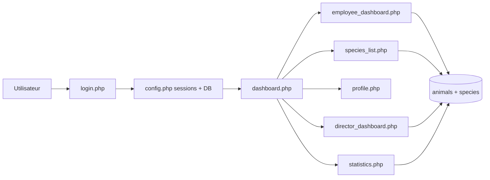

# Digital Zoo


Une application web de gestion de zoo avec authentification, gestion des animaux et des especes, profils utilisateurs, et tableau de bord statistique pour les directeurs.

---

## Apercu Visuel


### Interfaces principales

| Ecran | Description |
|---|---|
| Connexion | Authentification securisee avec redirection selon le role |
| Tableau de bord | Vue globale avec compteurs (animaux, especes) |
| Gestion des animaux | Ajout, recherche, modification du nom, suppression |
| Gestion des especes | Ajout, recherche, edition, consultation des animaux |
| Gestion des employes (directeur) | Creation, edition, suppression des utilisateurs |
| Statistiques (directeur) | Graphiques Chart.js (especes, genres, evolution) |

---

## Fonctionnalites

- Authentification et sessions PHP
- Roles: salarie et directeur
- CRUD animaux
- CRUD especes
- Gestion des utilisateurs (reservee directeur)
- Changement de mot de passe depuis le profil
- Recherche textuelle (animaux, especes, employes)
- Visualisation statistique avec Chart.js

---

## Stack Technique

- Backend: PHP procedurale
- Base de donnees: MariaDB / MySQL
- Frontend: HTML, CSS, Font Awesome
- Graphiques: Chart.js
- Environnement local recommande: DDEV

---

## Architecture Rapide



---

## Demarrage Rapide (DDEV)

1. Aller dans le dossier du projet:

   ```bash
   cd digital-zoo
   ```

2. Lancer les services:

   ```bash
   ddev start
   ```

3. Importer la base:

   ```bash
   ddev import-db --src=zoo_management.sql
   ```

4. Ouvrir le projet:

   ```bash
   ddev launch
   ```

---

## Demarrage Manuel (PHP + MySQL)

1. Copier le dossier dans votre serveur local (XAMPP/WAMP/LAMP).
2. Creer une base de donnees (ex: zoo_management).
3. Importer le fichier SQL: `zoo_management.sql`.
4. Adapter la connexion dans `config.php` si necessaire.
5. Ouvrir `login.php` dans le navigateur.

---

## Notes Base de Donnees

Le code du module directeur utilise une colonne `salary` dans la table `users`.

Si vous utilisez le dump SQL actuel, ajoutez cette colonne pour eviter les erreurs SQL:

```sql
ALTER TABLE users
ADD COLUMN salary DECIMAL(10,2) NOT NULL DEFAULT 0.00;
```

---

## Parcours Utilisateur

1. Creation de compte via `register.php`
2. Connexion via `login.php`
3. Acces au tableau de bord `dashboard.php`
4. Navigation selon le role:
   - Salarie: animaux, especes, profil
   - Directeur: animaux, especes, employes, statistiques, profil

---

## Structure du Dossier

```text
digital-zoo/
├── config.php
├── login.php
├── register.php
├── dashboard.php
├── employee_dashboard.php
├── director_dashboard.php
├── species_list.php
├── statistics.php
├── profile.php
├── style.css
├── preview.jpg
└── zoo_management.sql
```

---

## Securite et Ameliorations Proposees

- Utiliser uniquement des mots de passe hashes dans les donnees seed
- Ajouter des requetes preparees partout (certaines requetes restent directes)
- Ajouter une protection CSRF sur les formulaires POST
- Mettre en place des tests fonctionnels pour les parcours critiques

---

## Licence

Projet educatif. Adaptez la licence selon vos besoins (MIT recommande).
